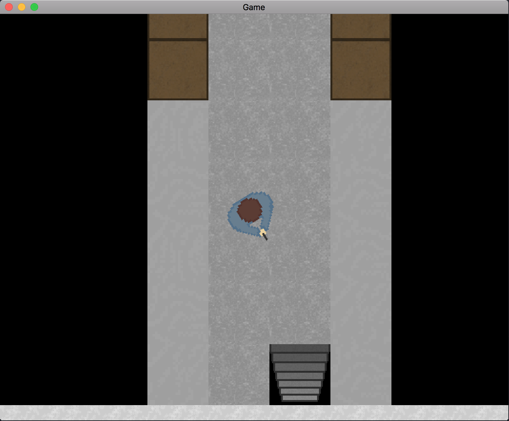

# Game

Coded in C++ using the SDL2 Development Library

Made in my spare time over summer 2018 ~~to completely dwarf and be better than hotline miami~~ to improve my knowledge of C++ and get better at creating bigger programs. Much was learnt but this project is as readable as a bag of scrabble tiles.

